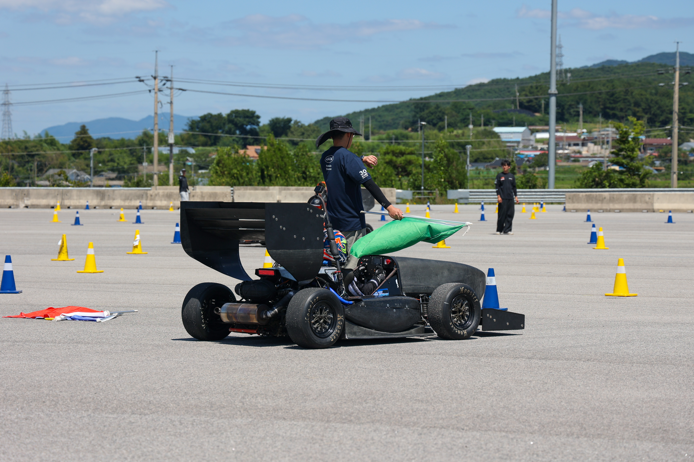

<p align="center"><sub>&lt;FSK 2026 2nd Test week, NS26F&gt;</sub></p>

# NS26F Electrical & Electronics

NS26F 전장 파트 통합 저장소.

## 폴더 구조

```text
NS26F-Electrical-Electronics-Part/
├── brake-light/                         # 브레이크등
│   └── hardware/
│       └── imported-source/
│           └── NS26F_BrakeLight/        # KiCad 및 생산 파일
│
├── dashboard/
│   ├── display-ui/
│   │   └── nextion/
│   │       └── 260815_Dashboard_UI.HMI  # Nextion 디스플레이 UI
│   ├── datalogger/
│   │   ├── hardware/
│   │   │   └── imported-source/
│   │   │       └── NS26F-Datalogger-HW/ # KiCad 및 생산 파일
│   │   └── firmware/
│   │       └── stm32cubeide/
│   │           └── Datalogger_final3/   # STM32CubeIDE 프로젝트
│   └── shiftlight/
│       ├── hardware/
│       │   └── imported-source/
│       │       └── RPM/                 # KiCad, Gerber, 생산 파일
│       └── firmware/                    # 현재 자료 없음
│
├── telemetry/                           # TTGO LoRa 무선통신
│   ├── vehicle-node/                    # 차량 측 송신기
│   │   ├── hardware/
│   │   └── firmware/LoRaSender/
│   ├── receiver/                        # 수신기
│   │   ├── hardware/
│   │   └── firmware/LoRaReceiver/
│   ├── protocol/                        # LoRa 및 Serial 규격
│   ├── viewer/
│   │   ├── lora-monitor/                # 로컬 Serial 뷰어
│   │   └── telemetry-dashboard/         # CSV 및 웹 뷰어
│   ├── docs/
│   └── test/
│
├── harness/                             # 현재 자료 없음
├── docs/                                # 공통 문서
├── shared/                              # 공용 라이브러리 및 DBC
├── releases/                            # 릴리스 파일
└── archive/                             # 로컬 백업, Git 제외
```

## 자료 현황

| 구분 | 내용 | 경로 |
|---|---|---|
| Brake Light HW | KiCad 프로젝트, BOM, 생산 파일 | `brake-light/` |
| Datalogger HW | KiCad 프로젝트, BOM, 생산 파일 | `dashboard/datalogger/hardware/` |
| Datalogger FW | STM32CubeIDE 프로젝트 | `dashboard/datalogger/firmware/` |
| Dashboard UI | Nextion Editor HMI 프로젝트 | `dashboard/display-ui/nextion/` |
| Shift Light HW | KiCad 프로젝트, BOM, Gerber | `dashboard/shiftlight/hardware/` |
| Telemetry Sender/Receiver | TTGO T3 LoRa32, 915 MHz | `telemetry/vehicle-node/`, `telemetry/receiver/` |
| Telemetry Local Viewer | Serial 표시 및 CSV 저장 | `telemetry/viewer/lora-monitor/` |
| Telemetry Viewer | CSV 분석 및 실시간 데이터 뷰어 | `telemetry/viewer/telemetry-dashboard/` |
| Harness | 현재 자료 없음 | `harness/` |
| Shift Light FW | 현재 자료 없음 | `dashboard/shiftlight/firmware/` |

데이터로거 펌웨어의 기존 Git 이력과 KiCad 자동 저장 이력은 `archive/`에 로컬 보관되어 있으며 저장소에는 포함되지 않는다.
